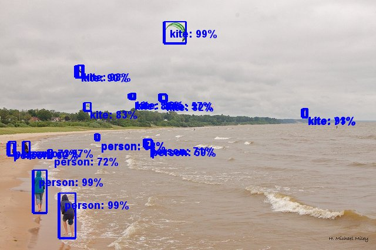
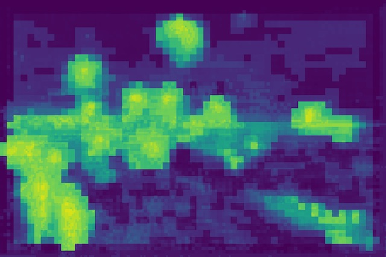
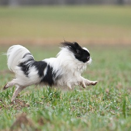
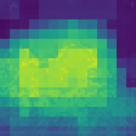
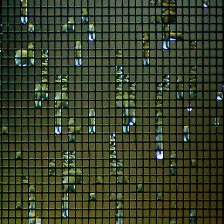
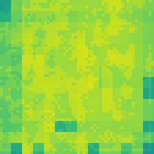

# Spatially Adaptive Computation Time for Residual Networks

This code implements a deep learning architecture based on Residual Network that dynamically adjusts the number of executed layers for the regions of the image.
The architecture is end-to-end trainable, deterministic and problem-agnostic.
The included code applies this to the CIFAR-10 an ImageNet image classification problems.
It is implemented using TensorFlow and TF-Slim.

Paper describing the project:

Michael Figurnov, Maxwell D. Collins, Yukun Zhu, Li Zhang, Jonathan Huang, Dmitry Vetrov, Ruslan Salakhutdinov. Spatially Adaptive Computation Time for Residual Networks. *CVPR 2017* [[arxiv]](https://arxiv.org/abs/1612.02297).

Image (with detections)          | Ponder cost map
:-------------------------------:|:--------------------------------------:
|

## Setup

Install prerequisites:

``` bash
pip install -r requirements.txt  # CPU
pip install -r requirements-gpu.txt  # GPU
```

Prerequisite packages:
 - Python 2.x/3.x (mostly tested with Python 2.7)
 - Tensorflow 1.0
 - NumPy
 - (Optional) nose
 - (Optional) h5py
 - (Optional) matplotlib

Run tests. It takes a couple of minutes:

``` bash
nosetests --logging-level=WARNING
```

## CIFAR-10

Download and convert CIFAR-10 dataset:

``` bash
python external/download_and_convert_data.py --dataset_name=cifar10 --dataset_dir="${HOME}/tensorflow/data/cifar10"
```

Let's train and continuously evaluate a CIFAR-10 Adaptive Computation Time model with five residual units per block (ResNet-32):

``` bash
export ACT_LOGDIR='/tmp/cifar10_resnet_5_act_1e-2'
python cifar_main.py --model_type=act --model=5 --tau=0.01 --train_log_dir="${ACT_LOGDIR}/train" --save_summaries_secs=300 &
python cifar_main.py --model_type=act --model=5 --tau=0.01 --checkpoint_dir="${ACT_LOGDIR}/train" --eval_dir="${ACT_LOGDIR}/eval" --mode=eval
```

Or, for _spatially_ adaptive computation time (SACT):

``` bash
export SACT_LOGDIR='/tmp/cifar10_resnet_5_sact_1e-2'
python cifar_main.py --model_type=sact --model=5 --tau=0.01 --train_log_dir="${SACT_LOGDIR}/train" --save_summaries_secs=300 &
python cifar_main.py --model_type=sact --model=5 --tau=0.01 --checkpoint_dir="${SACT_LOGDIR}/train" --eval_dir="${SACT_LOGDIR}/eval" --mode=eval
```

To download and evaluate a [pretrained ResNet-32 SACT model](https://s3.us-east-2.amazonaws.com/sact-models/cifar10_resnet_5_sact_1e-2.tar.gz) (1.8 MB file):

``` bash
mkdir -p models && curl https://s3.us-east-2.amazonaws.com/sact-models/cifar10_resnet_5_sact_1e-2.tar.gz | tar xv -C models
python cifar_main.py --model_type=sact --model=5 --tau=0.01 --checkpoint_dir='models/cifar10_resnet_5_sact_1e-2' --mode=eval --eval_dir='/tmp' --evaluate_once
```

This model is expected to achieve an accuracy of 91.82%, with the output looking like so:

```
eval/Accuracy[0.9182]
eval/Mean Loss[0.59591407]
Total Flops/mean[82393168]
Total Flops/std[7588926]
...
```

## ImageNet

Follow the [instructions](https://github.com/tensorflow/models/tree/master/inception#getting-started) to prepare the ImageNet dataset in TF-Slim format.
The default directory for the dataset is `~/tensorflow/imagenet`.
You can change it with the `--dataset_dir` flag.

Download [pretrained ResNet-101 SACT model](https://s3.us-east-2.amazonaws.com/sact-models/imagenet_101_sact_5e-3.tar.gz), trained with tau=0.005 (160 MB file):
``` bash
mkdir -p models && curl https://s3.us-east-2.amazonaws.com/sact-models/imagenet_101_sact_5e-3.tar.gz | tar xv -C models
```

Evaluate the pretrained model
``` bash
python imagenet_eval.py --model_type=sact --model=101 --tau=0.005 --checkpoint_dir=models/imagenet_101_sact_5e-3/train --eval_dir=/tmp --evaluate_once
```

Expected output:
```
eval/Accuracy[0.75609803]
eval/Recall@5[0.9274632117722329]
Total Flops/mean[1.1100941e+10]
Total Flops/std[4.5691142e+08]
...
```

Note that evaluation on the full validation dataset will take some time using only CPU.
Add the arguments `--num_examples=10 --batch_size=10` for a quicker test.

Draw some images from ImageNet validation set and the corresponding ponder cost maps:

``` bash
python imagenet_export.py --model_type=sact --model=101 --tau=0.005 --checkpoint_dir=models/imagenet_101_sact_5e-3/train --export_path=/tmp/maps.h5 --batch_size=1 --num_examples=200

mkdir /tmp/maps
python draw_ponder_maps.py --input_file=/tmp/maps.h5 --output_dir=/tmp/maps
```

Example visualizations. See Figure 9 of the paper for more

Image                      | Ponder cost map
:-------------------------:|:----------------------------:
  | 
  | 
  | 

## Disclaimer

This is not an official Google product.
